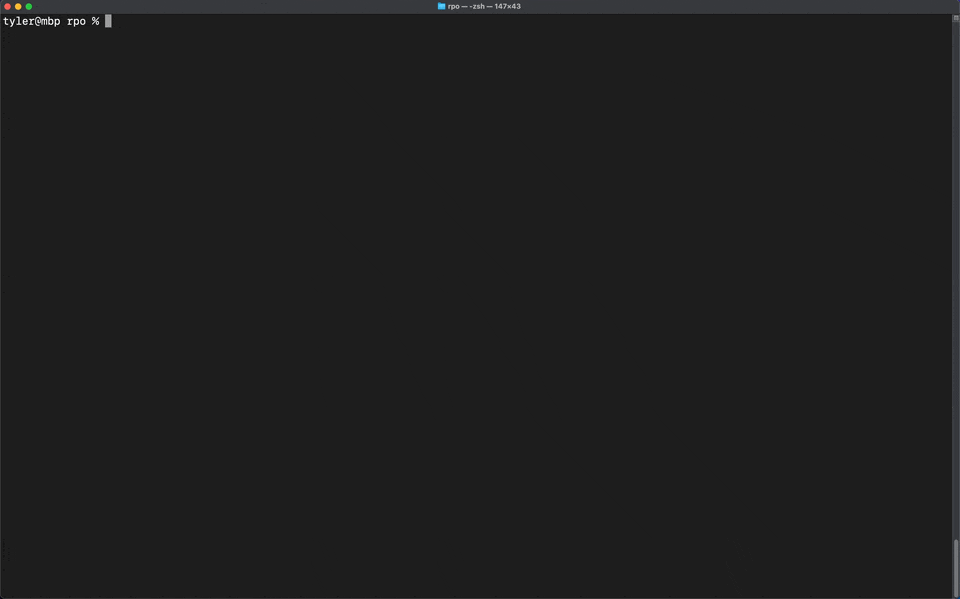

# rpotool

[](https://GitHub.com/tylertms/rpotool/releases/)
[](https://github.com/tylertms/rpotool/blob/main/LICENSE)

- [Installation](#installation)
- [Usage](#usage)
- [Importing to Blender](#importing-to-blender)
- [Compiling](#compiling)
- [License](#license)

Note: All assets and converted files are property of Auxbrain Inc. and should be used accordingly.

## Installation

1. Download the latest version of `rpotool` for your system from [GitHub releases](https://github.com/tylertms/rpotool/releases).

2. Extract the `.zip` archive and `cd` into the folder.

3. On macOS/Linux:
```
chmod +x rpotool
```

To obtain the default `.rpo` assets, unzip a `.apk` or `.ipa` game file and open the `/rpos` directory.

To obtain `.rpoz` shell assets, see the `search` command below.

## Usage
```
Usage: ./rpotool <folder or file.rpo(z)> [options]
Options:
  -s, --search <term>       Search for shells and download as .obj 
  -o, --output <path>       Output file or folder for the converted file(s)
```

On Windows, you can simply drag a .rpo file onto the .exe to convert it.

### Examples:

Convert `coop.rpo` to `coop.obj`.
```
./rpotool coop.obj
```

Convert the folder `rpos` to a new folder `objs`, using the `-o`/`--output` flag.
```
./rpotool rpos/ -o objs/
```



To browse, download, and convert shell files, use the `-s`/`--search` flag.


## Importing to Blender

By default, Blender does not recognize the vertex colors/textures in the converted .obj files.

After importing your .obj file into blender, complete the following:

1. Open the shading tab and select `+ New` to create a new material


2. Select `Add > Input > Color Attribute`


3. Connect the `Color` node of `Color Attribute` to the `Base Color` node of the material


## Compiling

You must have `gcc` installed and on your path.

```shell
$ git clone https://github.com/tylertms/rpotool.git
$ cd rpotool
$ make
```


## License

`rpotool` is released under the [MIT license](https://github.com/tylertms/rpotool/blob/main/LICENSE).
